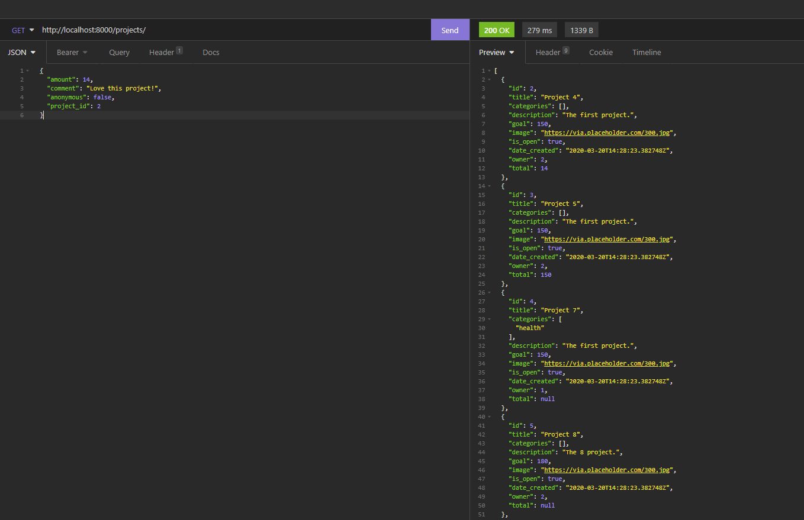

# Code for good
Code for good is a crowdfunding app, meant to support IT projects that matter. Anyone interested in them can support them either by donating maney or time coding along with others. 
Status: Finished all CRUD operations, except updating and deleting TimeDonations. 
## Deployed to Heroku: 
[Heroku app](https://quiet-hamlet-41512.herokuapp.com)

## MVP features
MVP
1. Sing up/login (auth)
2. See the list of projects
3. See a project, update and delete
4. See the list of pledges
5. See a pledge, update and delete
6. Donate time, see all time donations
7. Each project has a category
8. Show total of pledges

## Additional features (under way)
1. Send messages 
2. Show if a project has gained a desirable level of money/hours support
3. Promote projects

## Endpoints

[Get all projects](https://quiet-hamlet-41512.herokuapp.com/projects/)


Request body to create a new project:
```
{
        "title": "Project 99",
	      "categories": [
        "health"
         ],
        "description": "The 99 project.",
        "goal": 150,
        "image": "https://via.placeholder.com/300.jpg",
	      "date_created": "2020-09-20T14:28:23.382748Z",
        "is_open": true
        
        
    }
```


